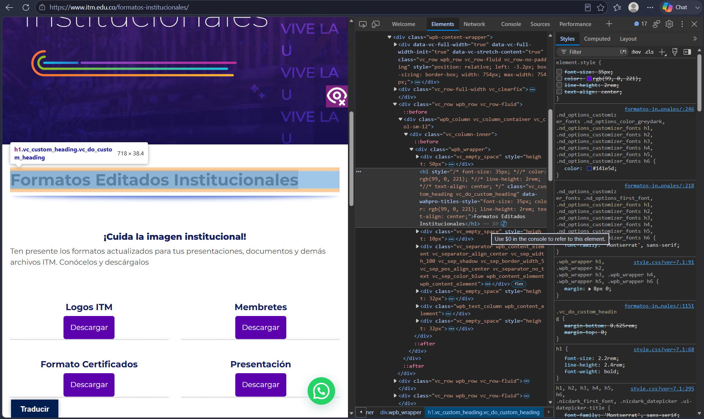
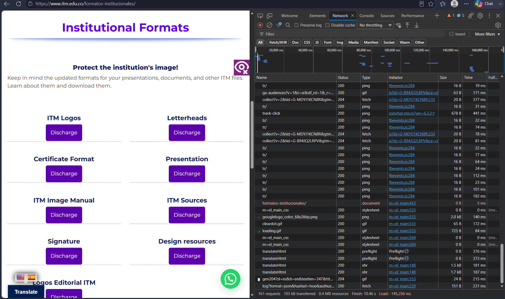

# Laboratorio 01
Informe de práctica de análisis de aplicación web.


2. Identificación de recursos
Resultados:
En la pestalla Network se observan multiples solicitudes.

Tabla con al menos 5 recursos diferentes (HTML, CSS, JS, imágenes, fuentes).  

| Recurso             | Tipo        | Dominio         | Tamaño |
|---------------------|-------------|-----------------|--------|
| analytics.js        | JavaScript  | www.itm.edu.co  | 0 B    |
| aseguradora_logo.jpg| Imagen      | www.itm.edu.co  | 0 B    |
| fa-solid-900.wolff2 | Fuente      | www.itm.edu.co  | 2 B    |
| style.css           | CSS         | www.itm.edu.co  | 0 B    |
| header_govco.png    | Imagen      | www.itm.edu.co  | 408  B |

Total de solicitudes observadas: 123 Request 


Análisis: 
¿Por qué una sola URL puede generar múltiples solicitudes HTTP?  
R// Porque escribir una sola URL en el navegador no se descarga unicamente el archivo HTML principal, ese documento normalmente tiene referencias a muchos otros recursos necesarios para mostrar la pagina completa (CSS, JavaScript, imagenes, tipografias, librerias o datos de la API)

---

3. Análisis de una solicitud HTTP

| Elemento            | Resultado                                                    | 
|---------------------|--------------------------------------------------------------|
| URL                 | [JavaScript](https://www.google-analytics.com/analytics.js)  | 
| Metodo HTTP         | GET                                                          | 
| Codigo de estado    | 200 OK (from disk cache)                                     |
| Host/Dominio        | www.google-analytics.com                                     |
| Tipo de recurso     | script (JavaScript)                                          | 
| Tiempo de respuesta | 3.49 ms                                                      | 


Análisis
¿Qué recurso solicito el navegador?
R// El navegador solicito el recurso "analytics.js", que es un archivo JS. Este archivo corresponde al script de seguimiento de Google Analytics.

¿Qué información permite determinar si la solicitud fue atendida correctamente?
R// La informacion que nos permite determinar si la solicitud fue atendida correctamente es el codigo de estado HTTP que devuelve el servidor, en este caso el Status Code 200 OK, esto nos confirma que el recurso fue entregado sin errores.

---

4.Inspeccion del DOM

| Elemento seleccionado| Etiqueta HTML | Contenido original       | Modificacion realizada                               |
|----------------------|---------------|--------------------------|------------------------------------------------------|
| Titulo principal     | <h1>          | Formatos institucionales | Formatos editados institucionales (cambio de color)  |





Análisis
¿La modificación realizada sobre el DOM alteró permanentemente la aplicación o los archivos almacenados en el servidor? Justifique.  

R// La modificacion no altera permanentemente la aplicacion ni tampoco los archivos almacenados en el servidor. Cunado se edita un elemento desde la pestalla Elements en DevTools, el cambio ocurre unicamente en la representacion local del DOM que mantiene el navegador en memoria.

Cuando volvemosa recargar la pagina, el navegador vuelve a solicitar el documento original al servidor y el cambio desaparece porque nunca se guardo en el back.  

---

5. Análisis de una interacción dinámica

   
| Acción realizada          | ¿Generó nueva solicitud? | URL solicitada                             | Método HTTP | Código de estado | Tipo de respuesta |
| --------------------------|--------------------------|--------------------------------------------|-------------|------------------|-------------------|
| Clic en botón “Traducir”  | Sí                       | "translateHtml" (servicio de traducción)   | GET         | 200 OK           | Documento HTML/JS |




Análisis
Explique la relación entre la acción realizada por el usuario y la solicitud observada.

R// Al hacer clic en el boton "Traducir", el navegador ejecuta codigo JS asociado a esa funcionalidad, ese codigo genera una nueva solicitud HTTP hacia el servicio de traduccion (translateHtml), que aparece en la pestaña Network, el servidor devuelve el contenido traducido y el navegador procesa la respuesta y actualiza el DOM, mostrando la pagina en el idioma seleccionado.

---

6. Reconstrucción del flujo observado

## 6. Reconstrucción del flujo observado

```mermaid
flowchart LR
    Usuario -->|Acción inicial (abrir página)| Navegador
    Navegador -->|Solicita recursos| SolicitudHTTP
    SolicitudHTTP --> Servidor
    Servidor -->|Responde con HTML, CSS, JS, imágenes| RespuestaHTTP
    RespuestaHTTP --> Navegador
    Navegador --> DOM
    DOM -->|Renderiza| Interfaz

    %% Inspección DOM
    Usuario -->|Inspección con DevTools| JavaScript
    JavaScript -->|Modifica temporalmente| DOM
    DOM -->|Cambio visible| Interfaz

    %% Interacción dinámica
    Usuario -->|Clic en Traducir| JavaScript
    JavaScript -->|Nueva solicitud| SolicitudHTTP
    SolicitudHTTP --> Servidor
    Servidor -->|Contenido traducido| RespuestaHTTP
    RespuestaHTTP --> JavaScript
    JavaScript -->|Actualiza| DOM
    DOM -->|Interfaz dinámica| Usuario


