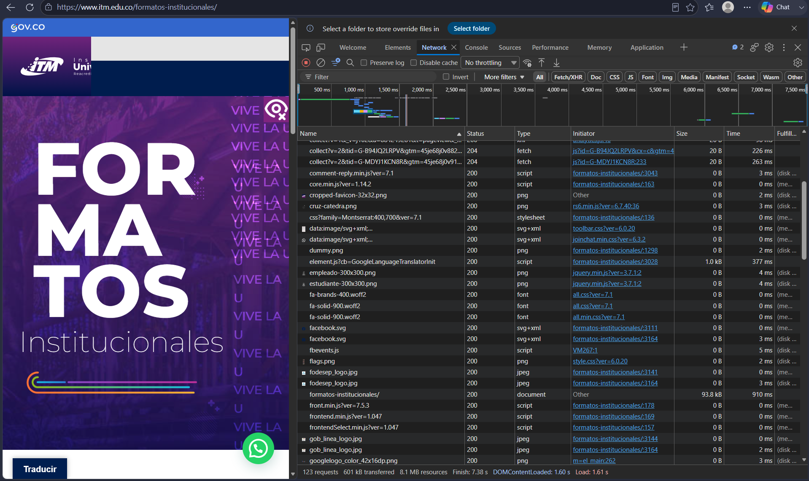
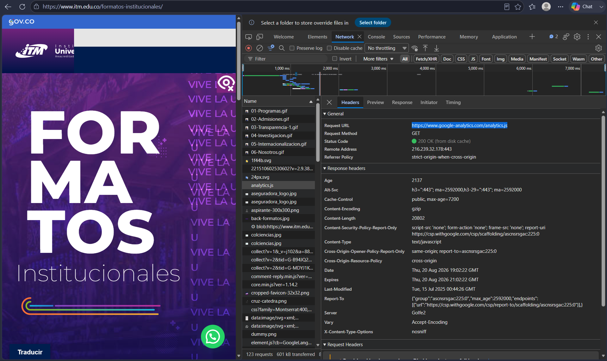

# Laboratorio 01
Informe de práctica de análisis de aplicación web.

2. Identificación de recursos
Resultados:
En la pestalla Network se observan multiples solicitudes.

Tabla con al menos 5 recursos diferentes (HTML, CSS, JS, imágenes, fuentes).  

| Recurso             | Tipo        | Dominio         | Tamaño |
|---------------------|-------------|-----------------|--------|
| analytics.js        | JavaScript  | www.itm.edu.co  | 0 B    |
| aseguradora_logo.jpg| Imagen      | www.itm.edu.co  | 0 B    |
| fa-solid-900.wolff2 | Fuente      | www.itm.edu.co  | 2 B    |
| style.css           | CSS         | www.itm.edu.co  | 0 B    |
| header_govco.png    | Imagen      | www.itm.edu.co  | 408  B |

Total de solicitudes observadas: 123 Request 

Análisis: 
¿Por qué una sola URL puede generar múltiples solicitudes HTTP?  
R// Porque escribir una sola URL en el navegador no se descarga unicamente el archivo HTML principal, ese documento normalmente tiene referencias a muchos otros recursos necesarios para mostrar la pagina completa (CSS, JavaScript, imagenes, tipografias, librerias o datos de la API)

---

3. Análisis de una solicitud HTTP

| Elemento            | Resultado                                                    | 
|---------------------|--------------------------------------------------------------|
| URL                 | [JavaScript](https://www.google-analytics.com/analytics.js)  | 
| Metodo HTTP         | GET                                                          | 
| Codigo de estado    | 200 OK (from disk cache)                                     |
| Host/Dominio        | www.google-analytics.com                                     |
| Tipo de recurso     | script (JavaScript)                                          | 
| Tiempo de respuesta | 3.49 ms                                                      | 

Análisis
¿Qué recurso solicito el navegador?
R// El navegador solicito el recurso "analytics.js", que es un archivo JS. Este archivo corresponde al script de seguimiento de Google Analytics.

¿Qué información permite determinar si la solicitud fue atendida correctamente?
R// La informacion que nos permite determinar si la solicitud fue atendida correctamente es el codigo de estado HTTP que devuelve el servidor, en este caso el Status Code 200 OK, esto nos confirma que el recurso fue entregado sin errores.

